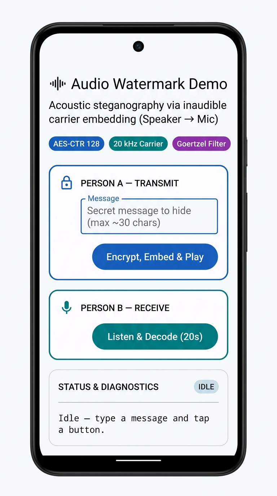
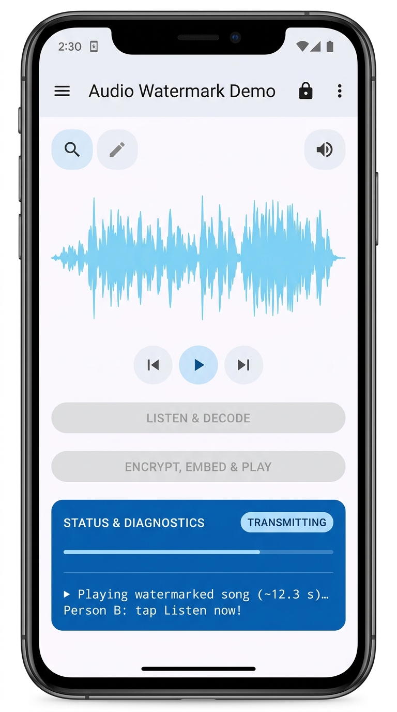
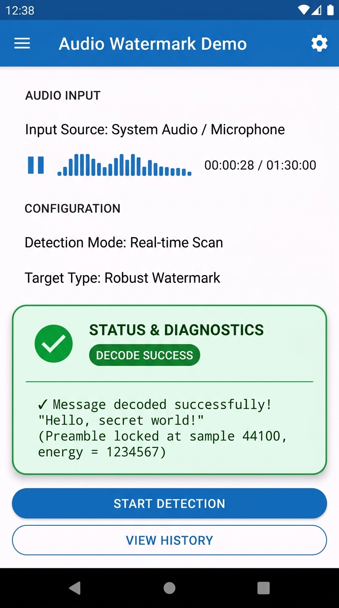
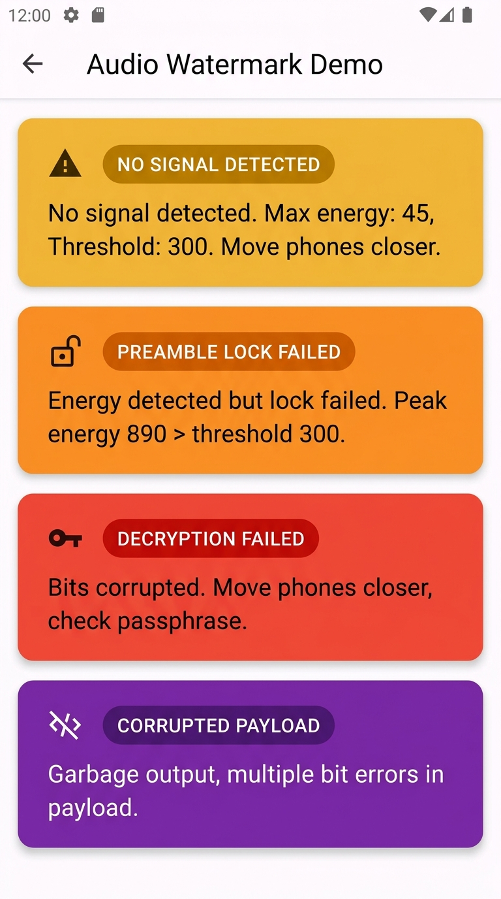
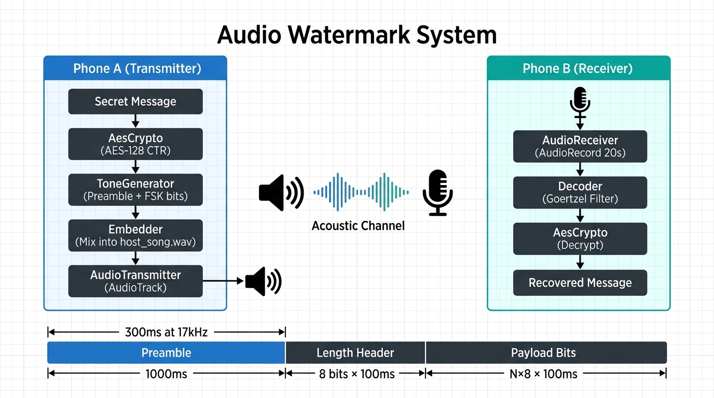

# Audio Watermark Demo

[](https://developer.android.com)
[](https://kotlinlang.org)
[](https://m3.material.io)
[](LICENSE)

> **Acoustic steganography** — encrypt a message, hide it in a song, transmit it acoustically from one Android phone's speaker, and recover it on another phone's microphone.

## How It Works

```
Phone A                          [Acoustic Channel]                  Phone B
  |                               speaker --> mic                       |
  | 1. Type secret message                                              |
  | 2. AES-128 CTR encrypt                                             |
  | 3. Convert bits to ultrasonic tones (17-19.5 kHz)                  |
  | 4. Mix tones into host_song.wav at -22 dBFS                        |
  | 5. Play via AudioTrack                  ===================>        |
  |                                                             6. Record 20s via AudioRecord
  |                                                             7. Goertzel filter decodes bits
  |                                                             8. AES-128 CTR decrypt
  |                                                             9. Display recovered message
```

**Key technique:** Binary FSK (Frequency Shift Keying) using ultra-high frequencies near 20 kHz, which are inaudible to most humans but reproducible by phone speakers and detectable by phone microphones.

## Quick Start

### 1. Clone
```bash
git clone https://github.com/Mallesh-MS/AudioWatermark.git
cd AudioWatermark
```

### 2. Prepare Host Song
```bash
ffmpeg -i your_song.mp3 -ar 44100 -ac 1 -sample_fmt s16 app/src/main/res/raw/host_song.wav
```
The song must be at least 30 seconds long and in 44100 Hz mono 16-bit PCM WAV format.

### 3. Build & Run
Open in Android Studio and click Run, or:
```bash
./gradlew installDebug
```

### 4. Test
1. Install on **two phones** with the same APK
2. **Phone A:** Type a message → tap "Encrypt, Embed & Play"
3. **Phone B:** Tap "Listen & Decode (20s)" → hold phones 10–30cm apart
4. Watch the decoded message appear on Phone B!

## Project Structure

| File | Responsibility |
|------|---------------|
| `Config.kt` | Shared parameters — frequencies, timing, passphrase |
| `AesCrypto.kt` | AES-128 CTR encryption / decryption |
| `Goertzel.kt` | Single-frequency energy detector (cheaper than FFT) |
| `ToneGenerator.kt` | Bytes → preamble + FSK tone sequence |
| `Embedder.kt` | Mix watermark into host song audio |
| `WavUtils.kt` | WAV file read / write |
| `AudioTransmitter.kt` | Streaming playback via `AudioTrack` |
| `AudioReceiver.kt` | 20-second microphone capture via `AudioRecord` |
| `Decoder.kt` | Full decode pipeline: preamble lock → bits → decrypt |
| `TransmissionSizing.kt` | Duration / samples calculation |
| `MainActivity.kt` | Single-screen UI wiring all components together |

## Technical Parameters

| Parameter | Value |
|-----------|-------|
| Sample rate | 44,100 Hz |
| Preamble frequency | 17,000 Hz |
| Bit-0 frequency | 18,000 Hz |
| Bit-1 frequency | 19,500 Hz |
| Symbol duration | 100 ms → 10 bits/sec |
| Watermark amplitude | 0.08 (-21.9 dBFS) |
| Encryption | AES-128 CTR |
| Max message length | ~30 chars (255-byte cipher limit) |
| Receive window | 20 seconds |

## Documentation

| Document | Description |
|----------|-------------|
| [ARCHITECTURE.md](docs/ARCHITECTURE.md) | Full technical design |
| [UI_UX_DESIGN.md](docs/UI_UX_DESIGN.md) | UI states, colors, icons, flows |
| [SETUP.md](docs/SETUP.md) | Build instructions & tuning guide |
| [CONTRIBUTING.md](docs/CONTRIBUTING.md) | Development guidelines |

## UI Screenshots

| Idle | Transmitting | Success | Error States |
|------|-------------|---------|-------------|
|  |  |  |  |

## Architecture



## Known Limitations

- **Fixed AES IV:** Reusing the same IV with the same key in CTR mode is a known weakness; acceptable for a course demo
- **Hardcoded passphrase:** No real key exchange; both devices share the same hardcoded secret
- **Fixed 20-second window:** Simpler than streaming detection; may miss messages that start late
- **No error correction:** A single misdetected bit corrupts the entire decrypted message
- **Max ~30 characters:** Constrained by the 1-byte (255-byte max) length header

## License

MIT License — see [LICENSE](LICENSE) for details.

---

*Signal Processing Project 2026 — Audio Watermark via Acoustic Steganography*
